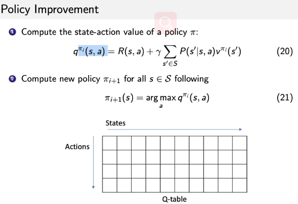

# Chap 2 MRP and MDP

- 马尔可夫价值过程 MRP：Markov 
    - 马尔科夫链：。。
    - 递减价值：G函数，discounted future reward
        - 立即价值R：在时刻t，在状态st的条件下，价值r的期望
            - R是仅关于s的函数
        - G（下标t，表示在t时刻）函数，价值函数，定义为：对于每个状态s，价值为s的立即价值R加上s之后所有（有限个，从t直到T）状态的R值（立即价值）之加权和。
        - 这里的权值是时间的减损：减损系数γ，s之后第n steps（大于t小于等于T）后的sn，呈上伽马的n次方
    - 马尔可夫价值过程：v函数
        - 状态之间转移的概率使用马尔科夫链建模，同时结合减损函数——贝尔曼方程
    - 贝尔曼方程计算（估算）
        - 蒙特卡罗算法：
            - 对于一个状态，计算，在这个状态时agent放入环境，得到一个episode（一局游戏，一个状态序列）
            - 根据这个episode，计算了贝尔曼方程（v使用立即价值r代替了）
            - 最有多次采样的episode结果求均
        - 动态规划
            - 结局状态价值就是立即价值
            - 根据贝尔曼方程，对每个状态的价值函数计算上一个时刻的价值函数值
            - 直到每个价值函数值趋于稳定（变化小于某个小值）
        - Temporal difference learning：时间差分方法
            - ？什么意思
- 马尔可夫决策过程：MDP
    - 
    - 动作概率函数：π，定义为某个状态，采取某个动作的概率
        - 目前，MDP和MRP，都是用来定义，不是用来学习
    - 此时的v函数：
    - q函数：定义为某个动作之后，到达某个状态的概率
    - 关系：
        - 
- 在MDP建模的基础上：
    - 两个问题
        - Prediction：
            - 输入是MDP（状态集，动作集，策略policy，立即奖励R，衰减系数γ）
            - 输出是价值函数
        - Control
            - 输入MDP（同上）
            - 输出是最优的价值函数，和最优的动作概率函数
    - 三个算法
        - Policy evaluation
            - 一种解决 Prediction 的算法
            - 基于 bellman expectation equation 贝尔曼期望等式
                - 
                - 这里的 R（s，a），当采取action 后 转移到的状态 不确定时，为收益的 期望
            - 从v1(s)开始，不断迭代，直到稳定
        - Policy iteration
            - 一种解决 Control 的算法
            - 两步走
                - Policy evaluation
                - Policy improvement：按照 Policy evaluation 的结果，调整策略
                    - 
                - 以上两步不断迭代，直到稳定
            - 一个证明：当更新 policy 之后，每个状态的能够获得更大的价值，因此可以说，基于这种方法 policy 是逐渐变好的
            
        - Value iteration
            - 一种解决 Control 的算法
            - Bellman optimal equation 
                - 
                - 由来：当 policy iteration 收敛之后，可得到，状态s的价值函数就等于，s下不同动作a的最大q函数，
                - 因此每次迭代，直接取价值函数的最大值
                - 
        
