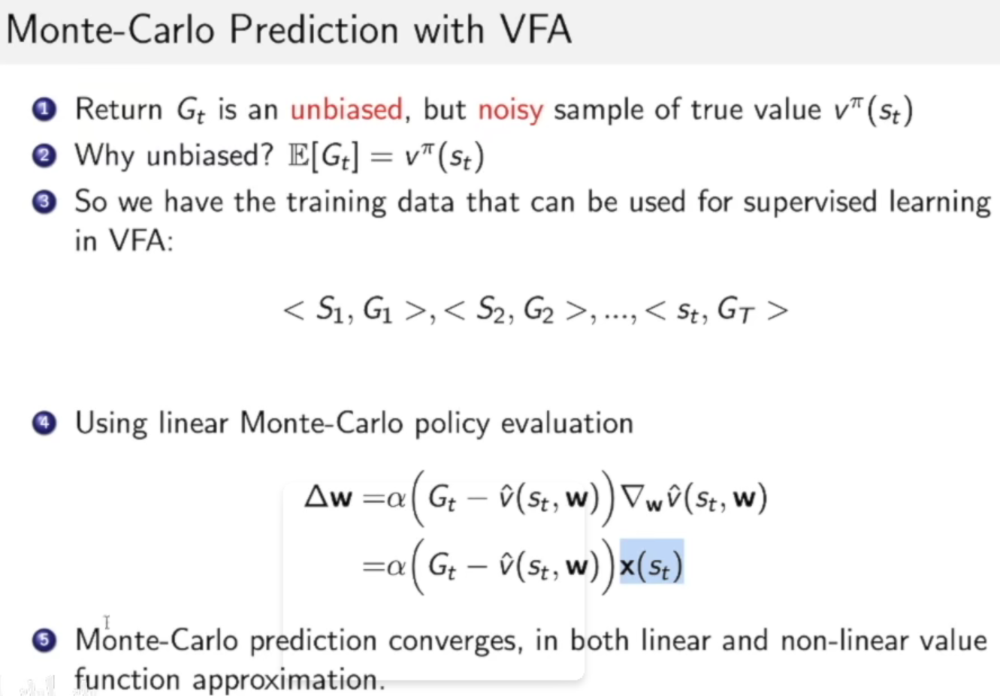
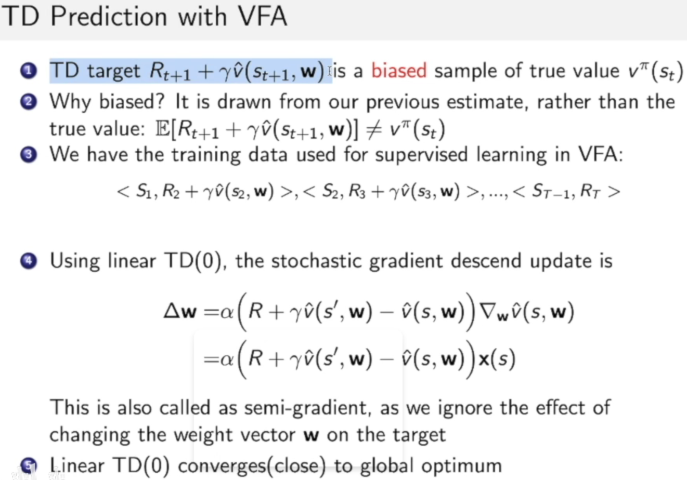

# Chap 4 价值函数的估计

- 由 model free 方法 引出，
    - 复杂问题，接近无限多状态和动作，传统 q table 将非常大不现实
    - 无法采样所有状态，希望通过模型 插值 拟合，估计所有状态
- 主要是两种：可以微分
    - 线性：即对特征 加权求和，得到价值，权值即为待定参数
        - 线性方法，可能可以得到全局最优解
    - 非线性：神经网络等
- 优化的 目标函数，以此进行梯度下降：
    - 构造目标函数，需要对 ground truth 进行估计
    - Prediction 问题
        - Monte Carlo 法采样，具有非偏性unbias，但noisy
        
        - TD法的 td target 两种 作为 优化 target ，off/on-policy，有偏性（target自身包含了待优化参数），称作 半梯度 semi-gradient
        
    - 同理对于 control 问题，估计的是 q 函数（状态-动作 价值），三种目标函数（损失函数）
    

